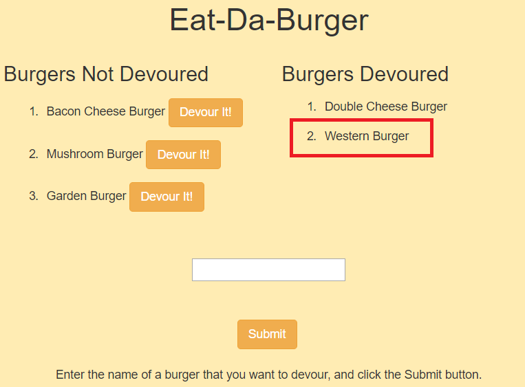

# Burger Project

In this project, the user enters the name of a burger in a text field, and then clicks the Submit button to display the burger name in the Burgers Not Devoured list on the left side of the screen. The user can then click the Devour It! button next to a burger in this list to move the burger name from the left side of the screen to the Burgers Devoured list on the right side of the screen.

# Sample Screenshots

The following image shows that "western burger" is entered in the text field.  

The following image shows that the western burger is displayed in the Burgers Not Devoured list after the user clicks the Submit button.

The following image shows that the western burger is displayed in the Burgers Devoured list after the user clicks the Devour It! button.

# Tools Used

- JavaScript
- html
- Bootstrap
- node.js
- MySQL
- MySQL Workbench
- ORM
- jQuery
- Heroku
- npm packages:
	- mysql
	- express
	- express-handlebars
	- body-parser   
